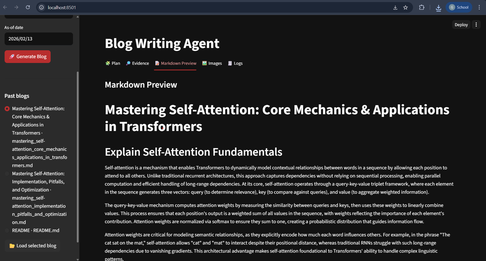
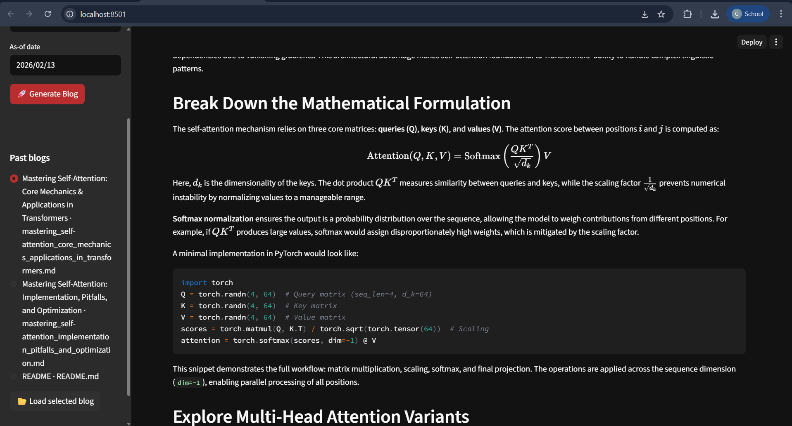
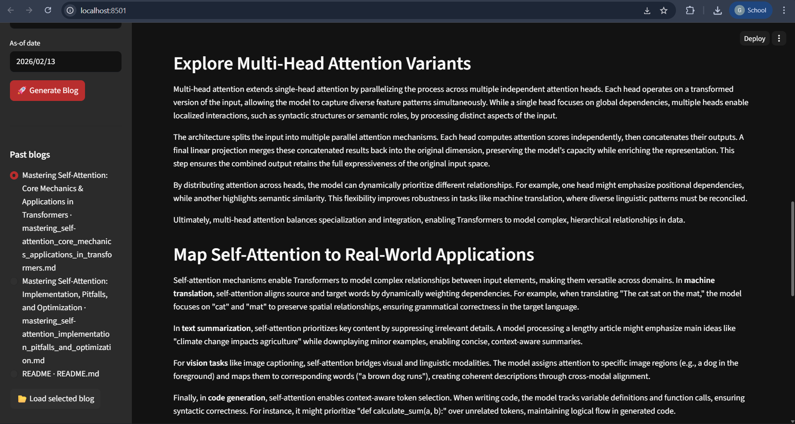
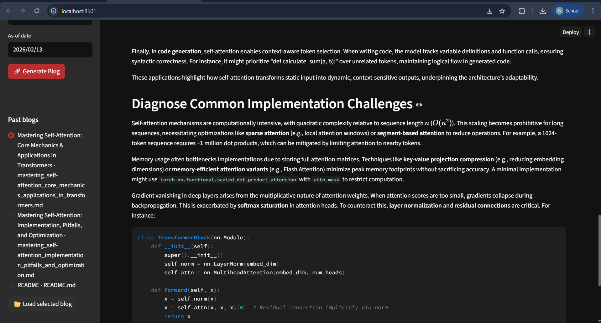
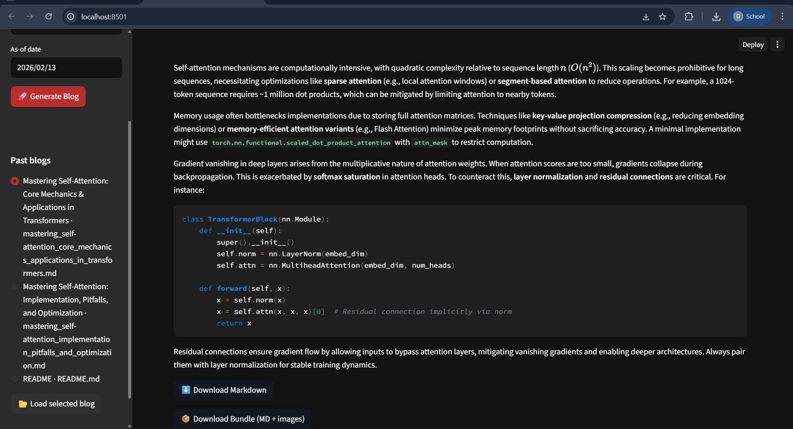

# ✍️ Blog Writing Agent (LangGraph + Streamlit)

An **AI-powered Blog Writing Agent** built using **LangGraph, LangChain, and Streamlit**.  
This system automatically generates **structured, research-backed blog posts**.

---

## 🏗️ Architecture Overview

    User Input (Topic)
            ↓
        Router Node
   (decides research mode)
            ↓
     ┌───────────────┐
     │ Research Node │ (optional)
     └───────────────┘
            ↓
     Orchestrator (Plan)
            ↓
   Parallel Workers (Sections)
            ↓
   Reducer Pipeline:
      - Merge Content
            ↓
       Final Blog (Markdown)

---

## 📂 Project Structure

    .
    ├── blog_writing_agent_frontend.py # Streamlit UI
    ├── blog_writing_agent_backend.py  # LangGraph pipeline
    ├── Output/
    │   └── result1.png
    ├── .env
    └── README.md

---

## ⚙️ Installation

    git clone https://github.com/GaneshGMgr/blog_writting_agent.git
    cd blog-writing-agent

    python -m venv venv
    source venv/bin/activate   # Mac/Linux
    venv\Scripts\activate      # Windows

    pip install -r requirements.txt

---

## ▶️ Run the App

    streamlit run blog_writing_agent_frontend.py

---

## 🧠 How It Works

### 1. Router
- Decides:
  - `closed_book` → no research
  - `hybrid` → partial research
  - `open_book` → full research

### 2. Research (Optional)
- Uses Tavily API
- Filters relevant and recent sources

### 3. Orchestrator
- Generates structured blog plan
- Defines sections and writing strategy

### 4. Workers (Parallel Execution)
- Each section written independently
- Ensures scalability and speed

### 5. Reducer Pipeline
- Merge all sections

---

## 🛠️ Core Components

- **Router Node** → decides research need  
- **Research Node** → fetches web data  
- **Orchestrator** → builds blog structure  
- **Worker Nodes** → generate sections  
- **Reducer Subgraph**:
  - merge_content

---

## 🧩 Technologies Used

- **Frontend:** Streamlit  
- **Orchestration:** LangGraph  
- **LLM:** Ollama-compatible models  
- **Search:** Tavily API  
- **Data Handling:** Pandas  
- **Storage:** Local files  

---
---
## 🖼️ Output / Demo

---